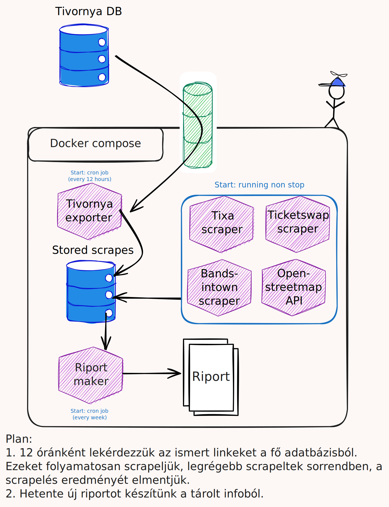

# Power BI 
Ez a repó tartalmazza azokat a kódokat, amik riportokat készítenek a Tivornya tartalmával kapcsolatban.

## Megvalósítás
Konténerizált projektek, amik 
1. összegyűjti a 3. félhez kapcsolódó linkeket a fő adatbázisból
2. lekérdezi az adatokat a harmadik felektől
3. eltárolja ezeket saját adatbázisban
4. a tárolt adatokból riportokat készít.



## Feladatok
- Tixa riport: A tixa.hu oldalon található kiemelt programok összehasonlítása a saját adatbázisban találhatóakkal. A hiányzó adatok jelentése, általános statisztika levonása csak jelen adatokra és az előző adatokhoz képest is.
- Bandsintown riport
- Funcode riport
- In-Time riport

# Fejlesztés
Futtatás
```shell
python3 -m venv .venv     # Virtuális környezet létrehozása
source .venv/bin/activate # Virtuális környezet aktiválása
python3 -m pip install -r folder/requirements.txt
set -a && source .env && set +a && PYTHONPATH="$(pwd)" python3 -m report.main
```
Merge előtt
- futtatás (lefut-e?)
```shell
python3 -m pylint --recursive=y --rcfile=folder/.pylintrc folder
```

# Teendők:
- [ ] tixa-report: Az adatbázis kapcsolat legyen opcionális.
- [ ] tixa-report: Minden ismert tixa_url megnézése hogy ott van e újdonság.
- [ ] tixa-report: Helyszín helyszíne.
- [ ] tixa-report: fontosság, dátum és név szerinti sort opció.
- [ ] ticketswap-report
- [ ] bandsintown-report